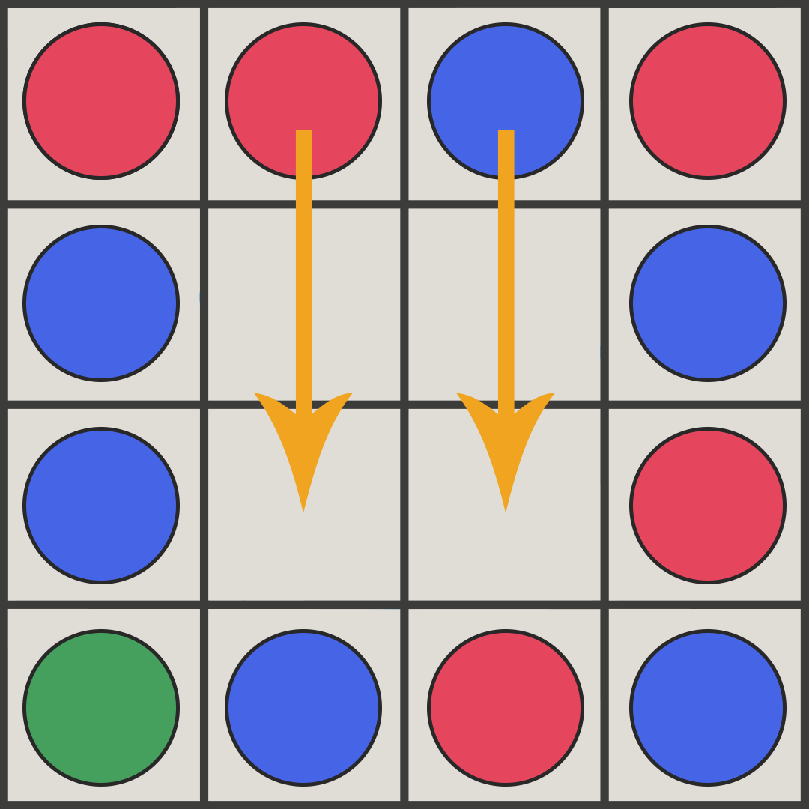

# SameGame
By **Théo Chollet** and **Tomy Da Rocha**.

## Presentation
The project consists in creating a game called "**SameGame**", it is a puzzle type game from the 80s.
The game takes place on a grid which is composed of **10 rows** and **15 columns**. Blocs are contained in this grid, they can be of **3 different colors**.

### Number of Players
1 player.

### Objective
The game consists in eliminating a **maximum of blocs** per move in order to obtain the **best score**.

### Game Setup
There is nothing to configure to start a game. The player can, however, start a new game by generating a **random grid**, or by loading a `.grid` file.

### Game Play
To eliminate a group of blocks, it must be **adjacent** to a bloc of the same color. The **more blocs** in the group eliminated by the player, the **higher the score** will be.

The game ends when no more groups (at least 2 adjacent blocs) are present in the grid.

|  |
| :--: |
| <b>4 Adjacent blocs</b>|

When deleting a **group of blocs**, the adjacent blocs can be **affected**. 

If they were **on top** of the deletion then they must **fall down** and replace the **empty space**.

|  |
| :--: |
| <b>The blocs are falling</b>|

If there is an **empty column** on their **left** then the **whole right column** will take the **empty space**.

|  |
| :--: |
| <b>Shifting the bloc column to the left</b>|

### Winning

There is no victory as such. Instead, the player will base his score on the **final score** he obtains.

## Context
This was the second project I did in my first year at university. I was in a group with my classmate Tomy Da Rocha.

We had to program with Java, which was much easier for the graphical aspect than the requirements of the first project in C.
